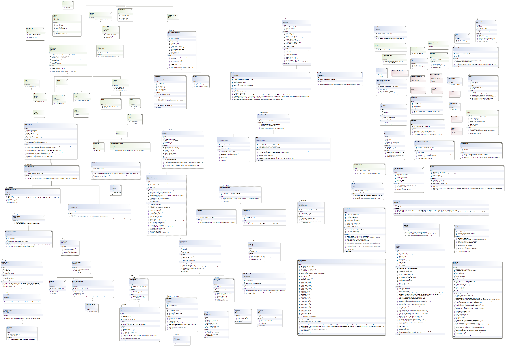

# Space Impact

An open-source [Universal Windows Platform (UWP)](https://docs.microsoft.com/en-us/windows/uwp/get-started/universal-application-platform-guide) implementation of a simple vertical space shooter game made using [Win2D](https://github.com/Microsoft/Win2D) library, inspired by [a popular game in Nokia 3310](https://en.wikipedia.org/wiki/Space_Impact) and [Space Impact: Kappa Base for Nokia N-Gage](https://www.youtube.com/watch?v=pvztKb6lqnQ). The included graphical and music assets were only used for educational purposes under fair use. They aren't available for a commercial use and I don't claim any ownership over them.

## Class Diagram

